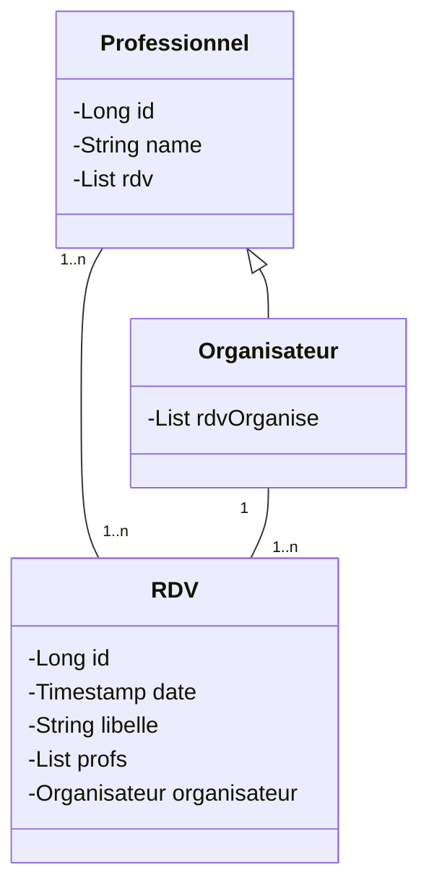

# Template de projet pour le TP JPA 2021 UniR

## Modèle métier du projet

```mermaid
classDiagram
    Professionnel <|-- Organisateur
    Professionnel "1..n" -- "1..n" RDV
    Organisateur "1" -- "1..n" RDV
    class Organisateur{
        -List<RDV> rdvOrganise
    }
    class RDV{
        -Long id
        -Timestamp date
        -String libelle
        -List<Professionnel> profs
        -Organisateur organisateur
    }
    class Professionnel{
        -Long id
        -String name
        -List<RDV> rdv
    }
```
