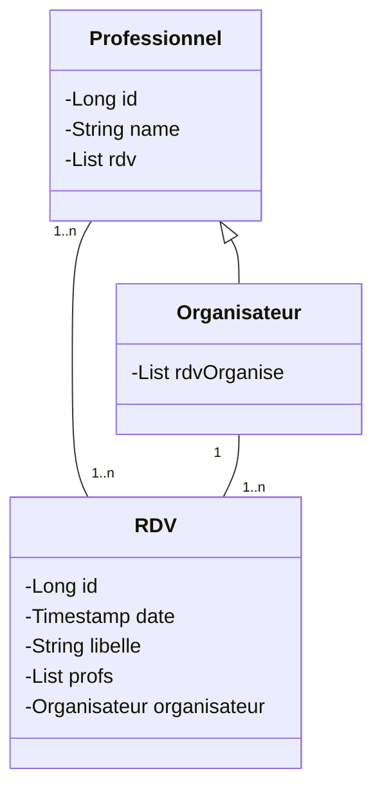

# Template de projet pour le TP JPA 2021 UniR

## Organisation du Git

Ce dépôt Git regroupe tous les travaux pratiques du module TAA. Les différentes étapes du TP sont réparties dans les branches correspondantes :

- "master" branche par default (pas à jour pour ce projet).
- "TP2_REST_API" pour le partie du TP JPA.
- "spring" pour la version finale.

## Modèle métier du projet


## Qualité du code/git

Voici un petit apperçu de le structuration du code de ce projet:
- [DTO](#dto) : src/main/java/fr/istic/tpSpring/dto
- [mapstruct](#mapstruct) : src/main/java/fr/istic/tpSpring/dto/mapper
- [API Rest](#api-rest) : src/main/java/fr/istic/tpSpring/rest
- [OpenAPI](#openapi) : pom.xml
- [AOP](#aop) : src/main/java/fr/istic/tpSpring/aspect
- [SpringBoot](#springboot) : pom.xml
- [KeyCloak](#keycloak) :
  - src/main/java/fr/istic/tpSpring/config/WebSecurityConfig.java
  - src/main/resources

## DTO
Mes DTO sont des objets simplifier par uniquement leurs identifiants. Il y a une classe dto par dao 

## mapstruct
J'ai fait un seul fichier mapstruct contenant mes transformation en dto/dao.

## API Rest
L'API propose les appels POST et GET pour ses objets. Je n'ai malheureusement pas pris le temps de faire d'autre type d'appel. J'ai néanmoins bien saisie comment le faire.

## OpenAPI
OpenAPI est présent. Un swagger est aussi déployé. Tout s'est fait (presque) automatiquement grace aux dépendences suivantes:

```xml
<dependency>
	<groupId>io.springfox</groupId>
	<artifactId>springfox-swagger-ui</artifactId>
	<version>2.7.0</version>
</dependency>

<dependency>
	<groupId>org.springdoc</groupId>
	<artifactId>springdoc-openapi-starter-webmvc-ui</artifactId>
	<version>2.2.0</version>
</dependency>
```

## AOP
J'ai ajouté un prncipe de log. Un pointcut est ajouté aux appels rest. Avant un appel, une log est écrite.

## SpringBoot
J'ai ajouté toutes les dépendences nécessaires au bon fonctionnement de spring.

## KeyCloak
J'ai suivi les instructions de ce [tutoriel](https://hackmd.diverse-team.fr/s/ByjU4Olbo). Tout c'est bien déroulé.
